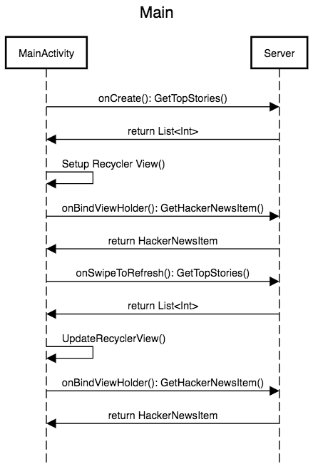

# The unofficial Hacker News Application

## Overview
Welcome 👋 This is a test application using Hacker News API. MVVM architecture is used during the development of the application.
It is written 100% in Kotlin with unit tests available on the view models.

## Sequence Diagram
The architecture of the project follows the principles of MVVM.
The sequence diagram of the application is shown as below:

No API calls is performed in Details Activity. Details Activity's data is passed from the Main Activity using Parcelable.

## Languages, libraries and tools used
* [Kotlin](https://kotlinlang.org/)
* Android Support Libraries
* [RxJava2](https://github.com/ReactiveX/RxJava/)
* [Dagger 2 (2.11)](https://github.com/google/dagger)
* [Retrofit](http://square.github.io/retrofit/)
* [OkHttp](http://square.github.io/okhttp/)
* [Gson](https://github.com/google/gson)
* [RxLifeCycle](https://github.com/trello/RxLifecycle)
* [PaperParcel](https://grandstaish.github.io/paperparcel/)
* [Shimmer](https://github.com/facebook/shimmer-android)
* [Mockito](http://site.mockito.org/)
* [Espresso](https://developer.android.com/training/testing/espresso/index.html)

## Installation
app-staging.apk can be found in "apk" folder
